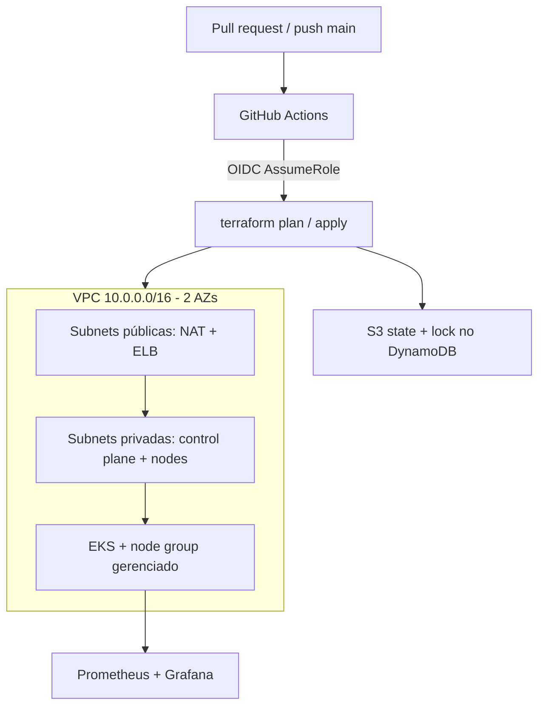

# eks-platform-infra

Terraform pra subir um EKS pequeno na AWS (VPC, cluster, um node group) com state
remoto e um CI que faz `plan` no PR e `apply` no merge pra main. A stack de
Prometheus/Grafana fica em `monitoring/`. É um ambiente de staging: algumas
escolhas aqui não passam em produção sem ajuste, e elas estão no fim do arquivo.

## Arquitetura



Os nodes saem pra internet pela NAT; a API do EKS está pública (ver o fim).

## Decisões

State no S3 com lock no DynamoDB. É o mínimo pra mais de uma pessoa (ou a pessoa
e o CI) mexerem na mesma infra sem corromper o state. O bucket e a tabela vêm do
stack em `bootstrap/`, que roda antes de tudo e guarda o próprio state local: não
tem como ele guardar state remoto no bucket que ele ainda vai criar.

A auth do CI na AWS é OIDC, não chave estática. O ARN do role fica no secret
`AWS_ROLE_ARN` e o Actions troca por credencial temporária na hora do job.
Preferi isso a deixar um `AWS_ACCESS_KEY_ID` parado num secret esperando vazar.

Node group é gerenciado, drain e rotação de AMI ficam com a AWS. Pra um cluster
desse tamanho não compensa cuidar de launch template e ASG na mão. Os nodes ficam
nas subnets privadas e saem pela NAT, e deixei só uma NAT em vez de uma por AZ
porque em staging três NAT é custo fixo que não se paga; é trocar
`single_nat_gateway` quando precisar de HA. A API do cluster está pública só pra
facilitar o acesso enquanto isso é staging. Restringir por CIDR (ou fechar com
VPN/bastion) é a primeira coisa antes de qualquer uso sério.

VPC e EKS vêm dos módulos da comunidade (`terraform-aws-modules`). Não ia
reescrever na mão o IAM, o OIDC provider e os addon que eles já resolvem e que
estão rodando em produção por aí há anos. Os módulos locais `network` e `eks` são
uma casca fina em cima, só pra fixar nome/tag e o que o root expõe. Provider e
módulos com versão presa, e o `.terraform.lock.hcl` vai versionado.

Os checks (`fmt`, `validate`, `tflint`, `trivy`) rodam num job separado, sem
credencial de nuvem, antes do `plan`, o PR quebra rápido sem gastar AssumeRole à
toa. O `trivy` faz scan de misconfig no terraform e barra em CRITICAL. O `plan`
(no PR) e o `apply` (na main) só rodam com a variável de repositório
`AWS_DEPLOY=true` e o secret `AWS_ROLE_ARN` setados; sem isso roda só os checks.

## Como rodar

Precisa de Terraform >= 1.6, AWS CLI logada, `kubectl` e `helm`. Pros checks
locais (opcional): `tflint`, `trivy`, `pre-commit`.

Backend, uma vez por conta:

```sh
cd bootstrap
terraform init
terraform apply   # se "platform-terraform-state" já existir, troque state_bucket_name (o nome é global)
cd ..
```

Infra:

```sh
cd terraform
cp terraform.tfvars.example terraform.tfvars
terraform init
terraform plan
terraform apply
```

O comando do kubeconfig sai como output do apply:

```sh
aws eks update-kubeconfig --name platform-staging --region us-east-1
```

Observabilidade em `monitoring/README.md`.

## O que faltou

- API do EKS aberta pra internet. Fechar por CIDR é o item zero.
- O state do `bootstrap/` é local, esse tfstate tem que ficar guardado em algum
  lugar. É pequeno, mas é state.
- Sem Ingress / ALB controller; expor serviço hoje é na unha.
- Alertmanager não notifica ninguém. Falta plugar Slack ou PagerDuty.
- Senha do Grafana criada na mão; o certo é External Secrets ou SSM.
- Falta policy as code (conftest/OPA) e teste de infra (terratest). O CI de hoje
  pega o básico.
- Um ambiente só. Multi-env eu faria com pasta por ambiente reusando o módulo, não
  com workspace.
- Isso custa dinheiro parado (NAT, control plane do EKS, EBS). `terraform destroy`
  quando não estiver usando.
